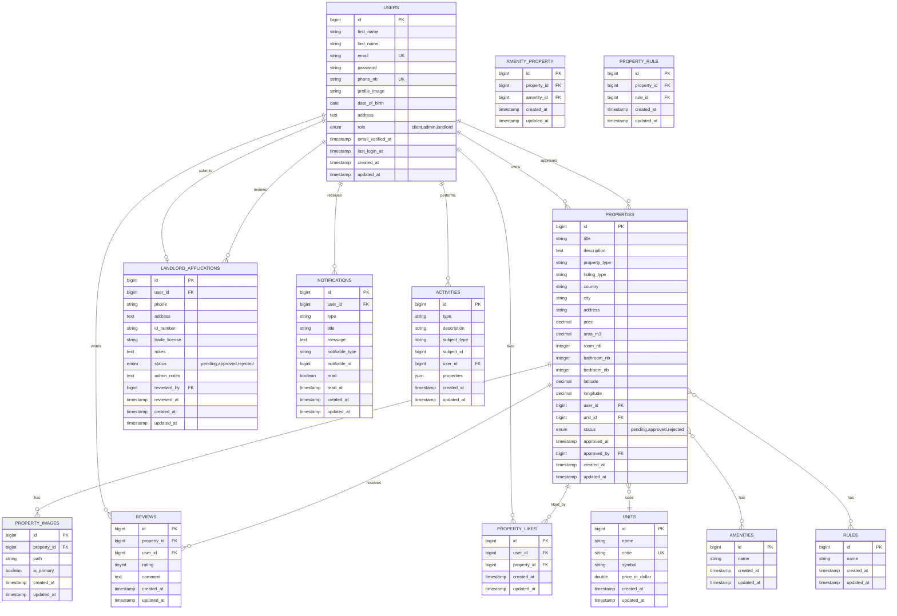

# Entity-Relationship Diagram for Ghorfa Project Database

## ER Diagram (Mermaid)

## Database Schema Summary

### Core Entities

1. **USERS** - User accounts with roles (client, admin, landlord)
2. **PROPERTIES** - Property listings with location, pricing, and details
3. **UNITS** - Currency/unit types for property pricing
4. **AMENITIES** - Available amenities (many-to-many with properties)
5. **RULES** - Property rules (many-to-many with properties)

### Relationship Entities

6. **PROPERTY_IMAGES** - Images associated with properties (one-to-many)
7. **REVIEWS** - User reviews for properties (many-to-many)
8. **PROPERTY_LIKES** - User likes for properties (many-to-many)
9. **AMENITY_PROPERTY** - Pivot table for property amenities
10. **PROPERTY_RULE** - Pivot table for property rules

### Application & Activity Entities

11. **LANDLORD_APPLICATIONS** - Applications to become a landlord
12. **NOTIFICATIONS** - User notifications (polymorphic)
13. **ACTIVITIES** - Activity log (polymorphic)

## Key Relationships

- **Users → Properties**: One-to-Many (user owns multiple properties)
- **Users → Reviews**: One-to-Many (user writes multiple reviews)
- **Users → Property Likes**: Many-to-Many (users can like multiple properties)
- **Properties → Amenities**: Many-to-Many (properties can have multiple amenities)
- **Properties → Rules**: Many-to-Many (properties can have multiple rules)
- **Properties → Unit**: Many-to-One (properties use a currency unit)
- **Properties → Images**: One-to-Many (property has multiple images)
- **Properties → Approved By**: Many-to-One (admin approves properties)
- **Landlord Applications → Reviewed By**: Many-to-One (admin reviews applications)
- **Notifications**: Polymorphic (can reference properties, applications, etc.)
- **Activities**: Polymorphic (can reference various entities)

## Notes

- **Polymorphic Relations**: 
  - `notifications.notifiable_type` and `notifications.notifiable_id` can reference different entities
  - `activities.subject_type` and `activities.subject_id` can reference different entities
  
- **Unique Constraints**:
  - `users.email` - unique
  - `users.phone_nb` - unique
  - `units.code` - unique
  - `property_likes(user_id, property_id)` - unique (user can only like a property once)

- **Cascade Deletes**:
  - Deleting a user cascades to their properties, reviews, likes, and applications
  - Deleting a property cascades to its images, reviews, likes, and pivot table entries
  - Deleting a unit cascades to properties using it
